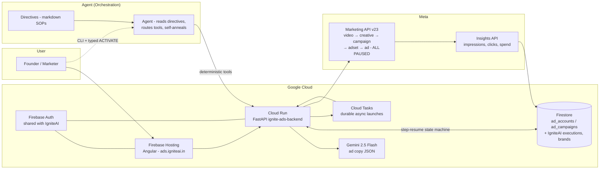

# Devpost Submission — Google for Startups AI Agents Challenge
> Portal: devpost.team/google-cloud-for-startups (project #19504) · Theme: **Build (Net-New Agents)** · Region: **APAC**
> Judging: Technical Implementation 30% · Business Case 30% · Innovation & Creativity 20% · Demo & Presentation 20%

---

## Project name
**IgniteAds — the autonomous media-buying agent**

## Problem to solve
*(paste into "Problem to solve")*

AI tools have made ad **creatives** nearly free — our startup IgniteAI already generates studio-quality UGC video ads in minutes. But the creative is only half the job. Actually **running** the ad still means hours inside Meta Ads Manager: uploading videos, writing policy-safe copy, building the campaign → ad set → ad hierarchy, picking budgets and placements, monitoring review status, and reacting to performance. For solo founders and small D2C brands (our customers), this operational wall is where most generated creatives die — they get downloaded and never launched. The business result: our users get value from creation but not from outcomes, and we leave the highest-value part of the funnel (media buying) on the table.

## Our solution
*(paste into "Our solution")*

**IgniteAds is an autonomous media-buying agent that closes the loop: generate → launch → measure → iterate.**

It takes any completed IgniteAI video (or any video URL), and as a single agent task: derives policy-safe ad copy with Gemini from the video's script + the user's brand kit, resolves the Meta identity chain (page, Instagram actor — including auto-creating a page-backed Instagram account when none exists), uploads the creative, and builds the full campaign → ad set → ad hierarchy on the Meta Marketing API. It then monitors review status and pulls performance insights, feeding the next round of creative generation.

The agent doesn't just respond — it **acts**, with production-grade guardrails:
- **3-layer architecture**: natural-language directives (SOPs) → agent orchestration → deterministic Python tools. The LLM decides; deterministic code executes. This is how we make a probabilistic agent reliable enough to spend real money.
- **Idempotent step-resume state machine**: every Graph API step persists its platform ID to Firestore before the next begins. Kill it anywhere, retry it, re-run it — zero duplicate campaigns, zero double spend. (Validated in production: our first real launch survived 3 interruptions across 3 resume cycles.)
- **Safety rails**: everything launches PAUSED; activation is a separate, human-confirmed step; hard daily-budget caps; full Graph API call audit logging.
- **Multi-tenant by design**: encrypted per-customer tokens (Phase B), shared Firebase Auth with our existing product, and a single monetization hook on our credits system.

This is a real launch engine, not a demo: it has created live (paused) campaigns on a real Meta ad account with real money one confirmation away.

## Technologies used
*(paste into "Technologies used")*

- **Gemini 2.5 Flash** — policy-aware ad copy generation (primary text / headline / description) from video scripts + brand kits, JSON-mode structured output
- **Cloud Run** — FastAPI backend (`ignite-ads-backend`), deployed via **Cloud Build** (no local Docker)
- **Firestore** — multi-tenant state: `ad_accounts` (token descriptors), `ad_campaigns` (launch state machine + per-step platform IDs), daily metrics snapshots
- **Cloud Tasks** — durable async launch execution with safe retries (idempotency keyed on launch_id)
- **Firebase Auth + Hosting** — shared identity with our existing IgniteAI platform; Angular dashboard at ads.igniteai.in
- **MCP (Model Context Protocol)** — agent-side inspection tooling for ad-account state during operations; the execution path itself is deterministic Python by design
- **Meta Marketing API (Graph v23)** — advideos, adcreatives, campaigns, adsets, ads, insights

## Data sources
*(paste into "Data sources")*

- IgniteAI `executions` (Firestore) — completed video runs: final video URLs + generation scripts (the copy source)
- IgniteAI `brands` (Firestore) — user brand kits: name, voice/character prompt (grounds the copy)
- Meta Marketing API — ad account/page/IG identities, video processing status, ad review status, Insights (impressions, clicks, CTR, spend, actions)
- Public GCS video URLs — creatives are fetched by Meta directly via `file_url` (no re-hosting)

## Findings and learnings
*(paste into "Findings and learnings")*

1. **Deterministic tools are what make agents production-safe.** Our first principle: the LLM never improvises an API call. Directives describe intent, the agent routes, deterministic code executes. 90% accuracy per step compounds to 59% over 5 steps — you cannot run ads that way.
2. **The Meta API's documented surface ≠ its real surface.** In one live launch we hit three undocumented/changed behaviors: video creatives require an Instagram actor even for Facebook-only placements (fixed by auto-creating a page-backed IG account); v23 silently renamed `instagram_actor_id` → `instagram_user_id`; campaigns now require `is_adset_budget_sharing_enabled`. Our self-annealing loop (fix → update tool → update directive) captured each one permanently.
3. **Idempotency is the most important property of a money-spending agent.** Persisting every step's platform ID before the next step made our launches resumable, retry-safe and duplicate-proof — proven when our first production launch was interrupted twice and completed cleanly.
4. **PAUSED-first is the right trust model.** Users (and we) need ad spend to be opt-in at the last possible moment: the agent does 100% of the work, the human gives one typed confirmation.

## Third-party integrations
*(paste into "Third-party integrations")*

- **Meta Marketing API** (Graph v23) — we operate our own Meta Business app (`development_access` tier) on our own ad account, fully authorized; multi-tenant customer OAuth is gated behind Meta App Review (in progress as Phase B)
- **Razorpay** (inherited, via IgniteAI's shared credits system) — monetization hook charges launch credits when pricing is enabled
- All ad creatives are generated by our own IgniteAI platform — we hold full rights

---

## Project assets (right panel)

| Asset | Link |
|---|---|
| **Code** | https://github.com/indieNik/ignite-ads (public, MIT) |
| **Video** | https://www.youtube.com/watch?v=3RMfih-jVuk |
| **Architecture diagram** | https://github.com/indieNik/ignite-ads/blob/main/docs/architecture.png |
| **Testing access** | https://ads.igniteai.in (Google sign-in) — supply a test Google account in the notes |

## Architecture diagram (export to PNG)

## 3-minute demo video script

| Time | Beat |
|---|---|
| 0:00–0:20 | Hook: "AI made ad creatives free. Launching them still costs hours in Ads Manager. IgniteAds is the agent that does it for you." Show an IgniteAI generated video. |
| 0:20–1:10 | The launch: dashboard (or CLI) → pick the video → Gemini suggests copy live → one command → show the Graph API log lines streaming (video → creative → campaign → adset → ad). |
| 1:10–1:40 | Cut to **real Meta Ads Manager**: the campaign exists, PAUSED, ₹100/day, "In review". Open Advanced Preview showing the ad across FB Feed / IG Reels / Stories. |
| 1:40–2:15 | Reliability story: kill the script mid-launch on camera → re-run `--resume` → "Skipping video_id (already done)" lines → no duplicates in Ads Manager. "This is how an agent earns the right to spend money." |
| 2:15–2:45 | Architecture slide (diagram above): directives → agent → deterministic tools; Gemini, Cloud Run, Firestore, Cloud Tasks; PAUSED-first + budget caps + typed activation. |
| 2:45–3:00 | Business case: "IgniteAI users generated 115 videos that never became ads. Now the same platform launches, measures, and iterates them. Generate → Launch → Measure → Iterate." |

## Business case talking points (judges weight 30%)
- Existing startup (IgniteAI: live SaaS, Razorpay billing, $49–$497/mo tiers) — this agent extends an existing revenue engine, not a toy
- Founder's own data: 115 completed creatives, ~0 launched → the launch wall is real and measured
- Monetization is one function away: `charge_ad_launch()` cost hook on the existing credits system; future: % of managed ad spend
- Moat: the closed loop (creative generation + performance data in one platform) feeds creative iteration nobody with only one half can do
